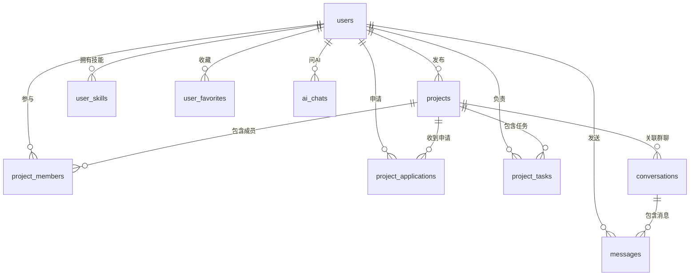

# OPC 后端数据库设计（简化版）

> 面向新手的第一版方案。先跑通核心流程，复杂功能后面再加。  
> 对照前端 5 个 Tab：**发现 / 项目 / 发布 / 消息 / 我的**，外加 **项目详情** 和 **问培风**。

---

## 1. 先建立整体概念

OPC 是一个 **个人项目协作 App**，用户可以做这些事：

1. **发现** — 浏览、搜索、收藏项目  
2. **发布** — 写想法，AI 帮忙整理成项目草稿  
3. **申请加入** — 在详情页提交申请  
4. **项目** — 看自己参与的项目、任务、进度  
5. **消息** — 和队友聊天  
6. **我的** — 个人资料、技能标签、草稿箱  
7. **问培风** — 全局 AI 助手（第一版可以先做简单问答）

### 第一版只做这些

| 做 | 暂不做（以后再加） |
|----|-------------------|
| 注册登录、个人资料 | 好友系统 |
| 发布/浏览/收藏项目 | 社区动态、点赞评论 |
| 申请加入、审核申请 | 知识库、项目复盘 |
| 项目列表、任务待办 | 文件上传、交付成果 |
| 基础聊天 | 复杂的 AI 推荐算法 |
| 简单 AI 对话 | 向量匹配、行为日志 |

### 表的数量

**第一版建议 10 张表**，够对接现有原型主流程。

---

## 2. 表之间的关系（一张图看懂）



**记住三个核心实体：**

- **用户 `users`** — 谁  
- **项目 `projects`** — 什么项目  
- **消息 `messages`** — 怎么沟通  

其他表都是给这三张表「打辅助」的。

---

## 3. 十张表详细设计

> 约定：每张表都有 `id`（主键）、`created_at`（创建时间）。  
> 类型不用纠结太细，MySQL / PostgreSQL 都可以，下面用通用写法。

---

### 3.1 `users` — 用户

对应页面：**我的、登录**

| 字段 | 类型 | 说明 |
|------|------|------|
| id | BIGINT | 主键，自增 |
| phone | VARCHAR(20) | 手机号（登录用） |
| password | VARCHAR(255) | 密码（存加密后的值） |
| nickname | VARCHAR(64) | 昵称，如「李同学」 |
| avatar | VARCHAR(512) | 头像 URL |
| bio | VARCHAR(500) | 简介，如「产品设计 / 在校学生」 |
| created_at | DATETIME | 注册时间 |
| updated_at | DATETIME | 最后修改时间 |

---

### 3.2 `user_skills` — 用户技能标签

对应页面：**我的 → 能力标签**

| 字段 | 类型 | 说明 |
|------|------|------|
| id | BIGINT | 主键 |
| user_id | BIGINT | 属于哪个用户 |
| skill_name | VARCHAR(64) | 如「产品设计」「AI工具」 |
| created_at | DATETIME | |

> 一个用户有多条技能，所以单独一张表，不要全塞在 users 里。

---

### 3.3 `projects` — 项目（最重要）

对应页面：**发现、发布、项目、详情**

| 字段 | 类型 | 说明 |
|------|------|------|
| id | BIGINT | 主键 |
| owner_id | BIGINT | 发布人（谁创建的） |
| title | VARCHAR(128) | 项目名 |
| description | TEXT | 项目介绍 |
| cover | VARCHAR(512) | 封面图 |
| tags | VARCHAR(255) | 标签，逗号分隔，如 `AI工具,产品设计` |
| status | VARCHAR(20) | 项目状态，见下表 |
| is_draft | TINYINT | 是否草稿：0已发布 1草稿 |
| work_mode | VARCHAR(20) | 协作方式：`remote`远程 / `onsite`线下 |
| duration_weeks | INT | 周期（几周），如 4 |
| deadline | DATE | 截止日期 |
| team_max | INT | 最多几人，如 5 |
| team_current | INT | 当前几人，如 3 |
| progress | TINYINT | 进度 0-100 |
| roles_json | TEXT | 招募角色（JSON 字符串），见下方示例 |
| phases_json | TEXT | 项目阶段（JSON 字符串），见下方示例 |
| ai_summary | TEXT | AI 生成的摘要（可选，第一版可空） |
| raw_input | TEXT | 发布页用户原始输入（给 AI 用） |
| view_count | INT | 浏览次数，默认 0 |
| created_at | DATETIME | |
| updated_at | DATETIME | |

**`status` 取值（对应项目页 4 个 Tab）**

| 值 | 含义 | 原型对应 |
|----|------|---------|
| recruiting | 招募中 | 详情页「未开始」 |
| pending | 待确认 | 项目 Tab「待确认」 |
| ongoing | 进行中 | 项目 Tab「进行中」 |
| done | 已完成 | 项目 Tab「已完成」 |
| archived | 已归档 | 项目 Tab「已归档」 |

**`roles_json` 示例**（招募角色，不用单独建表）：

```json
[
  {"name": "产品经理", "count": 1, "filled": 0},
  {"name": "前端开发", "count": 1, "filled": 0}
]
```

**`phases_json` 示例**（项目安排）：

```json
[
  {"name": "需求调研", "status": "done"},
  {"name": "原型设计", "status": "ongoing"},
  {"name": "功能评审", "status": "pending"}
]
```

> 第一版用 JSON 存角色和阶段，**少建 2 张表**，够展示详情页。以后数据复杂了再拆表。

---

### 3.4 `project_members` — 项目成员

对应页面：**详情页「3/5人」、项目卡片「团队·3人」**

| 字段 | 类型 | 说明 |
|------|------|------|
| id | BIGINT | 主键 |
| project_id | BIGINT | 哪个项目 |
| user_id | BIGINT | 哪个用户 |
| role_name | VARCHAR(64) | 担任角色，如「产品经理」 |
| joined_at | DATETIME | 加入时间 |

> 发布者创建项目时，自动插入一条成员记录（role_name 可写「发起人」）。

---

### 3.5 `project_applications` — 加入申请

对应页面：**详情页「申请加入」、我的 → 项目申请**

| 字段 | 类型 | 说明 |
|------|------|------|
| id | BIGINT | 主键 |
| project_id | BIGINT | 申请哪个项目 |
| user_id | BIGINT | 谁申请的 |
| role_name | VARCHAR(64) | 想担任的角色 |
| message | TEXT | 申请留言 |
| status | VARCHAR(20) | `pending`待审 / `approved`通过 / `rejected`拒绝 |
| match_score | INT | AI 匹配分 0-100（第一版可写死或不算） |
| match_reason | VARCHAR(255) | 推荐理由（第一版可空） |
| created_at | DATETIME | |

**简单流程：**

```
用户点「申请加入」→ 插入 status=pending
→ 发布者审核通过 → status=approved + 写入 project_members
```

---

### 3.6 `project_tasks` — 任务/待办

对应页面：**项目页「待处理」、问培风「今天要处理什么」**

| 字段 | 类型 | 说明 |
|------|------|------|
| id | BIGINT | 主键 |
| project_id | BIGINT | 属于哪个项目 |
| title | VARCHAR(255) | 任务标题，如「确认原型范围」 |
| assignee_id | BIGINT | 负责人（可为空） |
| status | VARCHAR(20) | `todo` / `done` |
| priority | VARCHAR(10) | `high` / `medium` / `low` |
| due_date | DATE | 截止日期 |
| created_at | DATETIME | |

---

### 3.7 `conversations` — 会话

对应页面：**消息列表**

| 字段 | 类型 | 说明 |
|------|------|------|
| id | BIGINT | 主键 |
| type | VARCHAR(20) | `private`私聊 / `group`群聊 / `project`项目群 |
| project_id | BIGINT | 项目群时关联项目（私聊可为空） |
| name | VARCHAR(128) | 会话名称，如「学习计划小助手小组」 |
| last_message | VARCHAR(255) | 最后一条消息摘要（方便列表展示） |
| last_message_at | DATETIME | 最后消息时间（用来排序） |
| created_at | DATETIME | |

> 第一版可以只做 **项目群聊**：用户加入项目后自动建群。

---

### 3.8 `conversation_users` — 会话参与者

| 字段 | 类型 | 说明 |
|------|------|------|
| id | BIGINT | 主键 |
| conversation_id | BIGINT | 哪个会话 |
| user_id | BIGINT | 哪个用户 |
| unread_count | INT | 未读消息数，默认 0 |

---

### 3.9 `messages` — 消息

对应页面：**聊天窗口**

| 字段 | 类型 | 说明 |
|------|------|------|
| id | BIGINT | 主键 |
| conversation_id | BIGINT | 属于哪个会话 |
| sender_id | BIGINT | 发送者 |
| content | TEXT | 消息内容 |
| ai_tag | VARCHAR(64) | AI 标记，如「需确认原型范围」（可为空） |
| created_at | DATETIME | |

> 第一版只做 **文字消息**，图片/文件以后再加。

---

### 3.10 `user_favorites` — 收藏

对应页面：**我的 → 收藏项目、发现页 swipe 收藏**

| 字段 | 类型 | 说明 |
|------|------|------|
| id | BIGINT | 主键 |
| user_id | BIGINT | 谁收藏 |
| project_id | BIGINT | 收藏哪个项目 |
| created_at | DATETIME | |

---

### 附：`ai_chats` — 问培风对话（第 11 张，可选）

第一版如果要接 AI，加这一张就够：

| 字段 | 类型 | 说明 |
|------|------|------|
| id | BIGINT | 主键 |
| user_id | BIGINT | 谁在用 |
| role | VARCHAR(10) | `user` 或 `assistant` |
| content | TEXT | 对话内容 |
| created_at | DATETIME | |

> 不用分 session 表，按 user_id + 时间排序即可。以后做「历史会话」再拆。

---

## 4. 页面对应哪张表（开发时查这张）

| 前端页面 | 主要用到的表 |
|---------|-------------|
| **发现** | projects（列表）、user_favorites（收藏） |
| **搜索** | projects（按 title、tags 搜索） |
| **发布** | projects（is_draft=1 存草稿） |
| **项目详情** | projects、project_members、project_applications |
| **项目列表** | projects、project_members、project_tasks |
| **消息** | conversations、conversation_users、messages |
| **我的** | users、user_skills、user_favorites、projects（草稿） |
| **问培风** | ai_chats、project_tasks（查待办） |

---

## 5. 三条核心业务流程

### 5.1 发布项目

```
1. 用户在发布页输入想法 → 存到 projects.raw_input
2. （可选）调 AI 接口 → 结果写入 title、description、roles_json
3. 用户点「保存草稿」→ is_draft=1
4. 用户点「发布」→ is_draft=0, status=recruiting
5. 自动插入 project_members（发布者本人）
```

### 5.2 申请加入

```
1. 用户在详情页选角色 → 插入 project_applications（status=pending）
2. 发布者在「项目申请」里审核
3. 通过 → status=approved，插入 project_members，team_current+1
4. （可选）自动创建 conversations 项目群
```

### 5.3 项目进行中

```
1. 发布者或成员创建 project_tasks
2. 成员在 messages 里沟通
3. 任务完成 → project_tasks.status=done
4. 手动改 projects.progress 和 projects.status
5. 完成后 status=done，归档 status=archived
```

---

## 6. 建议的开发顺序

按这个顺序做，每一步都能对接前端：

| 步骤 | 做什么 | 涉及表 |
|------|--------|--------|
| 1 | 用户注册登录 | users |
| 2 | 我的页资料、技能 | users, user_skills |
| 3 | 发布项目、草稿 | projects |
| 4 | 发现页项目列表、详情 | projects |
| 5 | 收藏 | user_favorites |
| 6 | 申请加入 | project_applications, project_members |
| 7 | 项目列表、任务 | projects, project_tasks |
| 8 | 消息聊天 | conversations, conversation_users, messages |
| 9 | 问培风 | ai_chats |

---

## 7. 以后扩展时再建的表

等功能稳定了，按需加表即可，不用一开始全做：

| 以后加 | 用途 |
|--------|------|
| notifications | 系统通知、待办提醒 |
| browse_history | 浏览记录 |
| project_files | 项目文件资料 |
| feed_posts | 社区动态 |
| knowledge_entries | 知识库 |
| project_reviews | 项目复盘 |
| friendships | 好友申请 |
| ai_recommendations | AI 推荐记录 |

---

## 8. 枚举值速查

```
projects.status:     recruiting | pending | ongoing | done | archived
projects.is_draft:   0=已发布  1=草稿
applications.status: pending | approved | rejected
tasks.status:        todo | done
tasks.priority:      high | medium | low
conversations.type:  private | group | project
```

---

*文档版本：v2.0 简化版 | 第一版 10~11 张表，够跑通主流程*
